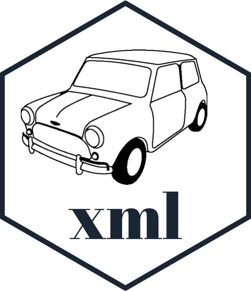

<!-- README.md is generated from README.Rmd. Please edit that file -->

# minixml 

<!-- badges: start -->


<!-- badges: end -->

`minixml` is a package for building xml documents in R.

### `minixml` vs `xml2`

`xml2` is a fantastic package for parsing a pre-existing XML file and
navigating through it, slicing it etc.

`minixml` is focussed on *creating* XML documents by assembling nodes
with attributes in a programmatic fashion.

## Overview

| Need to build | R6 object           | alternate initialisation |
| ------------- | ------------------- | ------------------------ |
| XML elements  | `XMLElement$new()`  | `xml_elem()`             |
| XML document  | `XMLDocument$new()` | `xml_doc()`              |

## Quick Examples

| XML Entity   | code                                                                 | result                            |
| ------------ | -------------------------------------------------------------------- | --------------------------------- |
| XML elements | `XMLElement$new('info', "Hello there")`                              | `<info>Hello there</info>`        |
| XML elements | `xml_elem('info', 'Hello')$update(date = '2019')`                    | `<info date="2019">Hello</info>`  |
| XML document | `this_xml <- XMLDocument$new('core'); this_xml$add('info', 'hello')` | `<core><info>hello</info></core>` |

## Installation

You can install `minixml` from
[GitHub](https://github.com/coolbutuseless/minixml) with:

``` r
# install.packages("devtools")
devtools::install_github("coolbutuseless/minixml")
```

## Interface

  - Individual elements can be created in a number of ways.
      - As a stand-alone element
          - `new_elem <- XMLElement$new('info', type = 'meta')`
          - `new_elem <- xml_elem('info', type = 'meta')`
      - As a sub-element of an existing document or element - the
        element is created, added to the parent document (or element)
        and returned.
          - `doc <- XMLDocument$new('xx'); new_elem <- doc$add('info',
            type = 'meta')`
          - `elem <- XMLElement$new('xxx'); new_elem <- elem$add('info',
            type = 'meta')`
  - `$add()` creates an element and adds it to the parent (and returns
    it)
      - `new_elem <- doc$add('info', type = 'meta')`
  - `$append()` appends the given elements as children
      - `new_elem <- xml_elem('info', type = 'meta');
        doc$append(new_elem, ...)`
  - `$new(name, ...)`, `$update(...)` and `$add(name, ...)` all accept
    `...` where
      - **named arguments** are added as *attributes* of this node
      - **unnamed argument** are added as *children* of this node

## Simple example

``` r
doc <- xml_elem("thing")
doc$add('node')$
  update(style = "color: blue;")$
  add('mytag', "Some example text.")

doc
```

``` 
   <thing>
     <node style="color: blue;">
       <mytag>
         Some example text.
       </mytag>
     </node>
   </thing>
```

## Parsing XML into a `minixml` document

`minixml` uses `xml2` to parse XML text (or file) into a `minixml`
document.

``` r
my_xml <- "<eg>Node contents</eg>"
doc <- minixml::parse_xml_elem(my_xml)
doc$update(x = 1, y = 2)$
  add(name = 'inner', 'inner contents')

doc
```

``` 
   <eg x="1" y="2">
     Node contents
     <inner>
       inner contents
     </inner>
   </eg>
```

## More complex example: Creating an XML `X3D` 3d object

[X3D](https://en.wikipedia.org/wiki/X3D) is an XML-based 3D object
format that is the successor to
[VRML](https://en.wikipedia.org/wiki/VRML).

In this example, we’ll build a simple 3D cube to view in the browser.

``` r
x3d <- xml_elem("x3d", width = "300px", height="200px")
shape <- x3d$
  add("scene")$
  add("shape")

shape$add("appearance")$add("material", diffuseColor = "0 0 1")
shape$add("box")

x3d
```

``` 
   <x3d width="300px" height="200px">
     <scene>
       <shape>
         <appearance>
           <material diffuseColor="0 0 1" />
         </appearance>
         <box />
       </shape>
     </scene>
   </x3d>
```

### View the object

To view the X3D object, include it in an HTML document with the
`x3dom.js` javascript.

The following code will run in an R session as an interactive 3d object
browser. On github you’ll just see a short gif.

``` r
html <- glue::glue("
<html> 
<head> 
  <script type='text/javascript' src='http://www.x3dom.org/download/x3dom.js'> </script> 
</head> 
<body>     {x3d}     </body> 
</html>")

htmltools::html_print(HTML(html))
```


